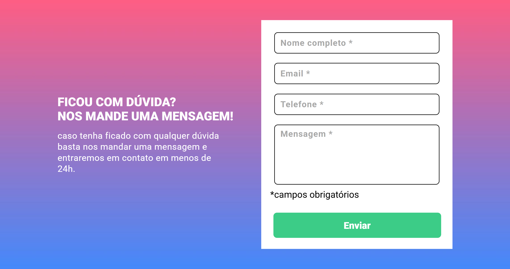

# Quest HTML, CSS, JS intermediário - Desafio - Formulário com validação

Esta é uma solução para a Quest de JS Intermediário.

## Índice

- [Visão geral](#Visão-geral)
  - [O desafio](#o-desafio)
  - [Screenshot](#Screenshot)
- [Meu processo](#meu-processo)
  - [Construído com](#construido-com)
  - [O que aprendi](#o-que-aprendi)
  - [Desenvolvimento contínuo](#desenvolvimento-contínuo)
- [Autor](#autor)

## Visão geral

### O desafio

- Construir o projeto de acordo com os designs fornecidos

### Screenshot

## Meu processo

### Construído com

- Semantic HTML5 markup
- CSS custom properties
- Flexbox
- CSS Grid
- Js intermediario
- [Styled Components](https://styled-components.com/) - For styles

### O que aprendi

Eu consolidei meus conhecimentos em JS, sendo a primeira vez que uso essa linguagem em um projeto.

### Desenvolvimento contínuo

Planejo continuar focando em em desenvolver minhas habilidades em JS.

## Autor

- Frontend Mentor - [@Isabela-Fernanda](https://www.frontendmentor.io/profile/Isabela-Fernanda)
- Gmail - [arty.7f@gmail.com](arty.7f@gmail.com)

